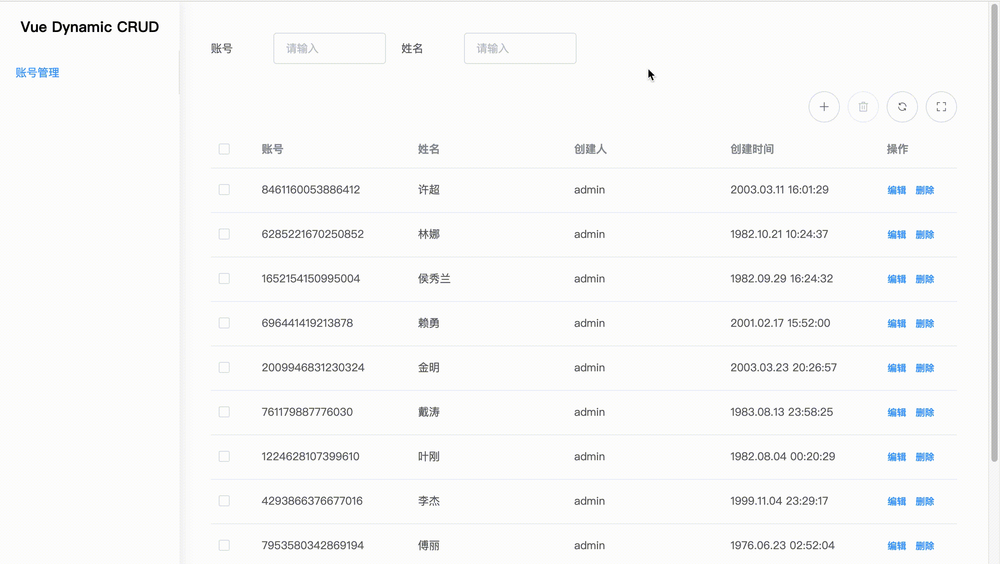
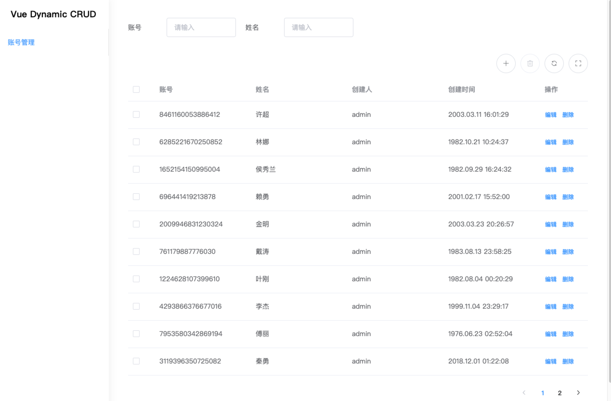

# vue-dynamic-crud

> The command line can generate CRUD code blocks, quickly build a CRUD front-end system, and support flexible configuration fields.




English | [简体中文](./README-zh.md)

---

## Features

- [x] CRUD module.
- [x] Fields are configurable, dynamically rendered.
- [x] Support command line to quickly generate code blocks.

## Preview



[Online](https://zengdoc.github.io/vue-dynamic-crud)

## Startup

### Install

```bash
npm install
```

### Development

```bash
npm run dev-[environment]
eg: npm run dev-dev

npm run mock    // mock mode
```

### Production

```bash
npm run build-[environment]
eg: npm run build-dev
```

##  Command Line

```
cd ./bin
:bin $ node ./crud create [module path] [module name]
```


## Components

#### Table GTable

##### Parameters

|        Field        |                   Type                    |          Description          |
| :-----------------: | :---------------------------------------: | :---------------------------: |
| **`searchConfig`**  | [SearchConfig[]](#Searchbar-SearchConfig) |    Searchbar configuration    |
| **`toolbarConfig`** |    [Toolbar[]](#Toolbar-ToolbarConfig)    |     Toolbar configuration     |
|    **`config`**     |         [Config[]](#Table-Config)         |      Table configuration      |
|     **`data`**      |           {[key: string]: any}            |   Current page data source    |
|     **`total`**     |                  Number                   |         Total number          |
|   **`pageSize`**    |                  Number                   | Number of data items per page |
|    **`pageNo`**     |                  Number                   |      Current page number      |

##### Event

|           Field           |            Type            |          Description           |
| :-----------------------: | :------------------------: | :----------------------------: |
|       **`search`**        |    {[key: string]: any}    |   Triggers when user search    |
|       **`command`**       | {event: String, item: row} | Triggers when user use toolbar |
| **`current-page-change`** |           Number           | Triggers when user change page |

#### Form GFormDialog

##### Parameters

|    Field     |                     Type                     |    Description     |
| :----------: | :------------------------------------------: | :----------------: |
| **`config`** | [FormDialogConfig[]](#Form-FormDialogConfig) | Form configuration |
|  **`data`**  |      {id?: String, [key: string]: any}       |  Form data source  |

##### Event

|           Field       |            Type            |          Description          |
| :-----------------------: | :------------------------: | :--------------------: |
|       **`close`**        | - |  Triggers when user close form  |
|       **`submit`**       | result,oldItem | Triggers when user submit form |

## Type

#### Searchbar SearchConfig

|   Field   |  Type  |                  Description                  |     Options      |
| :-------: | :----: | :-------------------------------------------: | :--------------: |
| component | String |                Child component                | GInput / GSelect |
|    ……     |   ……   | [Child component type](#Child-Component-Type) |        ……        |

#### Toolbar ToolbarConfig

| Field |  Type  |      Description      |                           Options                            |
| :---: | :----: | :-------------------: | :----------------------------------------------------------: |
|   -   | string | Toolbar configuration | CREATE / EDIT / DELETE / REFRESH<br/> / FULL_SCREEN / EXIT_FULL_SCREEN |

#### Table Config

|     Field     |  Type  |      Description      |           Options           |
| :-----------: | :----: | :-------------------: | :-------------------------: |
|  **`prop`**   | String |      Field name       |              -              |
|  **`label`**  | String | Label of this column  |              -              |
| **`width?`**  | String | Width of this column  |              -              |
| **`format?`** | String | Format of this column | dateTimeFormat / dateFormat |

#### Form FormDialogConfig

|   Field   |  Type  |                  Description                  |     Options      |
| :-------: | :----: | :-------------------------------------------: | :--------------: |
| component | String |                Child component                | GInput / GSelect |
|    ……     |   ……   | [Child component type](#Child Component Type) |        ……        |

## Child Component Type

####  Input GInput

|       Field        |       Type       |                         Description                          |
| :----------------: | :--------------: | :----------------------------------------------------------: |
|     **`prop`**     |      String      |                          Field name                          |
|    **`label`**     |      String      |                            Label                             |
|    **`value`**     | String \| Number |                            Value                             |
|    **`type?`**     |      String      | The type of input，see: [Element](https://element.eleme.cn/#/zh-CN/component/input) |
|  **`maxLength?`**  |      Number      |                        The max length                        |
| **`placeholder?`** |      String      |                   The placeholder of input                   |
|   **`disable?`**   |     Boolean      |                Whether the input is disabled                 |
|    **`rules?`**    |      Object      | Rules for field validation. see: [Element](https://ant.design/components/form) |

#### Select GSelect

|       Field        |              Type              |                         Description                          |
| :----------------: | :----------------------------: | :----------------------------------------------------------: |
|     **`prop`**     |             String             |                          Field name                          |
|    **`label`**     |             String             |                            Label                             |
|    **`value`**     |             String             |                            Value                             |
|   **`options`**    | {label: String, value: String} |                       Select options.                        |
| **`placeholder?`** |             String             |                  The placeholder of select                   |
|   **`disable?`**   |            Boolean             |                Whether the select is disabled                |
|    **`rules?`**    |             Object             | Rules for field validation. see: [Element](https://ant.design/components/form) |
